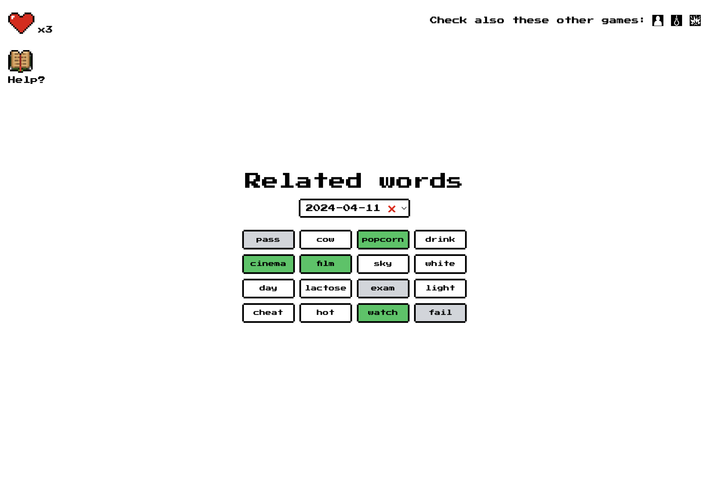

# Related Words with TypeScript and React

Done for educational purposes.

Deploy [here](https://ts-react-related-words.vercel.app/).
Repo [here](https://github.com/manuelsanchezweb/ts-react-related-words)

This is an attempt to start doing more web accessible games.

## Features

- √ Daily Challenges (Prototype)
- √ Completely accessible through keyboard and mouse
- √ Lives system
- √ Localstorage store
- √ Responsive
